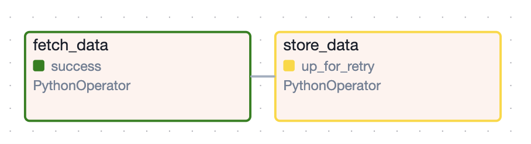
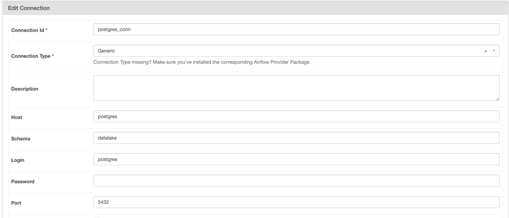

# **Teddy Challenge Airflow Documentation**


<h1 align="center">
    
</h1>

## Overview

This project is designed to manage and automate data processing workflows using Apache Airflow. The application orchestrates ETL (Extract, Transform, Load) tasks, fetches data from external APIs, processes the data, and stores the results in a PostgreSQL database. The project emphasizes modularity, scalability, and maintainability, allowing for easy addition of new tasks and workflows.

## Decision-Making Rationale

Several key decisions guided the development of this application to ensure its effectiveness and ease of use:

1. **Use of Apache Airflow**:

   Apache Airflow was selected as the workflow orchestration tool due to its rich features for managing complex workflows. It provides a user-friendly interface for monitoring and managing tasks, scheduling, and dependency management.

2. **PostgreSQL for Data Storage**:

   PostgreSQL was chosen as the database for storing processed data due to its robustness, scalability, and support for complex queries. The integration with SQLAlchemy facilitates smooth data interactions within Airflow tasks.

3. **Docker for Environment Management**:

   Docker is used to create a consistent development and production environment. This ensures that the application behaves consistently across different environments and simplifies the setup process for new developers.

4. **GitHub Actions for CI/CD**:

   GitHub Actions was implemented to automate testing and deployment workflows. Every push or pull request triggers automated tests, ensuring code quality and facilitating seamless integration into production.

### Database Configuration and Rationale

### Decision to Use a Shared PostgreSQL Instance

In this project, we chose to use the same PostgreSQL instance that Airflow uses for its metadata to also store our application's data. This decision was made to simplify the architecture, reduce overhead, and ensure consistent management of database resources.

By utilizing a single PostgreSQL instance, we benefit from:

1. **Simplified Infrastructure**: Managing one PostgreSQL instance reduces the complexity of maintaining separate database environments. It also minimizes the resources needed for running and monitoring multiple databases.
2. **Centralized Database Management**: Having a single PostgreSQL instance makes it easier to manage backups, security, and performance optimizations, as all database operations are concentrated in one place.
3. **Resource Efficiency**: Sharing the same PostgreSQL instance between Airflow and our application reduces the need for additional containers or services, conserving system resources.

### Implementation Details

To implement this decision, we created a separate database within the same PostgreSQL instance used by Airflow:

1. **Database Creation**:
   - A new database named `datalake` was created within the existing PostgreSQL instance that Airflow uses for its metadata.
2. **User and Password Configuration**:
   - The database `datalake` uses the same user credentials (`DB_USER` and `DB_PASSWORD`) that are defined in the `.env` file for accessing the Airflow database. This allows seamless integration and simplifies credential management.
3. **Applying Migrations**:
   - We applied the necessary migrations to the `datalake` database to ensure that our application's data models are correctly defined and ready for use. The migrations were managed using Alembic, ensuring that the schema is kept in sync with the application's evolving data models.

## Setup

### Prerequisites

- **Python 3.12+**: Ensure you have Python installed.
- **Apache Airflow**: Install Airflow as per the official documentation.
- **Docker**: Required for running the application environment.
- **Git**: For version control.
- **Make**: Used for running automation scripts.

### Clone the Repository

```bash
git clone https://github.com/zembruzkill/teddy_challenge_airflow.git
cd teddy_challenge_airflow
```

### Setting Up the `.env` File

The `.env` file is crucial for configuring your Airflow environment. Below are the environment variables you need to set:

- **AIRFLOW_UID**: This is the User ID (UID) of the user running the Airflow instance. This UID ensures that the Airflow containers have the appropriate file permissions when interacting with the host filesystem.
  - **On Linux/macOS**: You can find your UID by running the command `id -u` in the terminal. For most systems, it will be a number like `1000` or `501`.
    Example:
    ```bash
    AIRFLOW_UID=1000
    ```
  - **On Windows**: Windows does not use UIDs in the same way as Unix-based systems. Instead, Docker on Windows runs in a Linux-based virtual environment. If you're using Docker Desktop, the UID is typically set to `1000` by default. You may leave it as `1000` unless you encounter permission issues.
    Example:
    ```bash
    AIRFLOW_UID=1000
    ```
- **HOST**: The hostname or IP address of the PostgreSQL database.
- **DB_PORT**: The port number on which your PostgreSQL database is running, usually `5432`.
- **DB_USER**: The username for accessing the PostgreSQL database.
- **DB_PASSWORD**: The password associated with the database user.
- **DB_NAME**: The name of the database where Airflow will store its metadata.

1. **Create a `.env` file** in the root directory of the project and add the following environment variables:

```makefile

AIRFLOW_UID=501                # UID of the user running the Airflow instance
HOST=YOUR_DATABASE_HOST        # Database host name
DB_PORT=YOUR_DATABASE_PORT        # Database port
DB_USER=YOUR_DATABASE_USER     # Database username
DB_PASSWORD=YOUR_DATABASE_PASSWORD  # Database user's password
DB_NAME=YOUR_DATABASE_NAME     # Name of the database to be used

```

### Complete Setup in One Command

To set up the environment and start Airflow in one step, you can create a `Makefile` with the following commands:

```makefile
setup_all: setup_venv setup_airflow_and_db migrate

# Create a virtual environment
setup_venv:
	@echo "Setting up virtual environment..."
	pipenv install --dev

# Run Docker Compose to start the database
setup_airflow_and_db:
	@echo "Starting airflow and database with Docker Compose..."
	docker-compose up -d
	pipenv run alembic upgrade head

# Perform migrations
migrate:
	@echo "Running migrations..."
	pipenv run alembic upgrade head

```

## Accessing the Airflow Web Server

To access the Airflow web server, follow these steps:

1. **Open a Web Browser**: In your web browser, navigate to the following URL:

   ```
   http://localhost:8080
   ```

2. **Login**: If you have set up authentication, enter your credentials to log in to the Airflow dashboard.
   1. **User**: airflow
   2. **Password**: airflow

## Configuring a Connection in Airflow

To configure a connection in Airflow, follow these steps:

1. **Access the Admin Panel**: In the Airflow web server, click on the "Admin" tab in the top navigation bar.
2. **Select Connections**: From the dropdown menu, click on "Connections."
3. **Create a New Connection**:

   - Click the **"+"** button to add a new connection.
   - Fill in the following details:

     - **Conn Id**: A unique identifier for the connection (`postgres_conn`).
     - **Conn Type**: Select the appropriate connection type (e.g., `Generic`).
     - **Host**: Enter the database host (e.g., `YOUR_DATABASE_HOST`).

       💡 **Note:** Since we are using the same PostgreSQL instance for Airflow, ensure that the connection host is set to the container name `postgres`. This will allow Airflow to connect to the database correctly within the Docker network.

     - **Schema**: Enter the database name (e.g., `datalake`).
     - **Login**: Enter the database user (e.g., `YOUR_DATABASE_USER`).
     - **Password**: Enter the database password (e.g., `YOUR_DATABASE_PASSWORD`).
     - **Port**: Enter the database port (e.g., `5432`).

4. **Save the Connection**: After filling in the required fields, click the **"Save"** button to create the connection.

### Visual Guide

<h1 align="center">
    
</h1>

## Testing and Linting

### Running Tests

Automated tests are included to ensure functionality. To run the tests, you can create a test directory and use a testing framework like `pytest`:

```bash
pytest tests/
```

### Linting

Linting is done using Flake8. You can run linting with the following command:

```bash
flake8 .
```

## Logging

The application uses Airflow's built-in logging system to track the execution of tasks and workflows. Logs are accessible via the Airflow web interface, providing insights into the status and results of each task.

## FAQ

### What should I do if a task fails?

Check the task logs in the Airflow web interface to identify the error. Ensure that the necessary dependencies are met and that the environment variables are correctly set.

### How do I add new tasks to a DAG?

1. Define your new task as a Python function.
2. Create a corresponding Airflow operator to call the function.
3. Add the task to the desired DAG in the `dags/` directory.

### How do I schedule a DAG to run periodically?

Use the `schedule_interval` parameter in the DAG definition to specify how often it should run. For example, to run a DAG every day at midnight:
